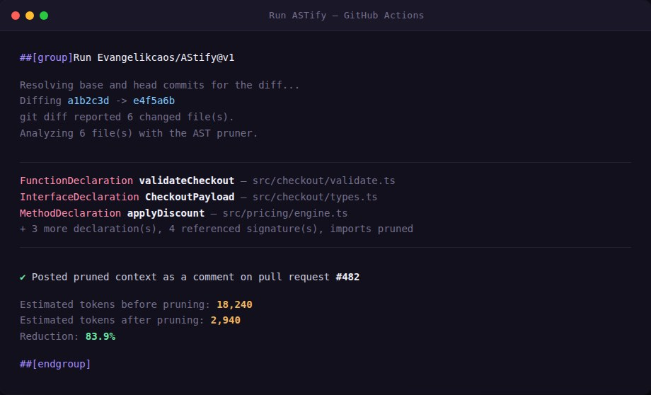

# ASTify

**Prune the noise out of your pull request diffs before they hit an LLM.**

ASTify is a GitHub Action that reads the `git diff` of a pull request, parses the affected TypeScript/JavaScript files with a real AST (via [ts-morph](https://ts-morph.com/), built on the TypeScript compiler itself — not a heuristic), and strips out everything an AI code-review agent doesn't need: comments, formatting, unrelated files, and untouched functions. What's left is the structurally relevant code — the declarations that actually changed, the signatures of anything they call, and the imports that connect them — ready to hand to an LLM in your CI/CD pipeline at a fraction of the token cost.



## Why teams use it

- **Cut AI review costs, not review quality.** Sending an entire changed file to an LLM burns tokens on every untouched line, comment, and import. ASTify keeps only what actually changed plus the minimal context needed to understand it.
- **Real AST parsing, not regex.** Built on `ts-morph`/the TypeScript compiler, so it understands `allOf`-style type composition, class hierarchies, and symbol resolution — not just text patterns.
- **Drop-in CI step.** One `uses:` line in your existing pull-request workflow. No infrastructure, no external service, no API key beyond the GitHub token your workflow already has.
- **Posts directly to the PR.** ASTify updates a single summary comment on the pull request with the token-reduction metrics and a per-file breakdown, instead of duplicating comments on every push.
- **Safe by design.** ASTify only shells out to `git diff` and statically parses text — it never executes, installs, or builds the code it analyzes.
- **Independently audited.** The full implementation went through a line-by-line correctness and security review (OWASP-aligned categories: injection, DoS, security misconfiguration, insecure design) — every finding fixed and covered by a regression test. The full report ships in the private repository.

## How it works

1. **Diff** — reads `git diff` between the pull request's base and head commits to find changed files and exact changed line ranges.
2. **Parse** — loads each changed file into a real AST.
3. **Prune** — keeps declarations that overlap a changed range in full (comments stripped), reduces anything they merely *reference* to a signature-only stub, and drops unused imports entirely.
4. **Report** — writes a structured JSON context plus a Markdown summary, and posts/updates that summary as a PR comment.

```yaml
# .github/workflows/ai-review.yml
- uses: actions/checkout@v4
  with:
    fetch-depth: 0

- name: Prune the diff with ASTify
  id: astify
  uses: Evangelikcaos/AStify@v1
  with:
    github-token: ${{ secrets.GITHUB_TOKEN }}

- run: echo "Reduction: ${{ steps.astify.outputs.reduction-percentage }}%"
```

## What's included

- Full TypeScript source: the AST pruning engine, git-diff parsing, JSON/Markdown formatting, and the Action entry point (`@actions/core` + `@actions/github`).
- A complete `vitest` unit test suite covering the pruner, formatter, and git-diff parsing.
- The `AUDIT.md` code review report — every finding, its fix, and the regression test that proves it.
- CI workflow (typecheck, test, build-freshness check, and the Action dogfooding itself on its own PRs).
- Configurable inputs: file-extension filtering, per-run file limits, per-file size limits, output format, and PR-comment toggling.

This is the commercial distribution of ASTify's private repository. Purchasing grants you access to the full source on GitHub.

## Get access

<p align="center">
  <a href="https://www.paypal.com/ncp/payment/KN78NFJJBQFEY">
    
  </a>
  <br>
  <a href="https://www.paypal.com/ncp/payment/KN78NFJJBQFEY"><strong>Pay with PayPal →</strong></a>
</p>

After payment, you'll be invited as a collaborator to the private `AStify` repository with the full source, test suite, audit report, and documentation.

## Requirements

- A GitHub Actions workflow triggered on `pull_request`
- Node.js 20+ runtime (provided automatically by `ubuntu-latest` runners)

## License

Commercial — see the private repository for full terms upon purchase.
